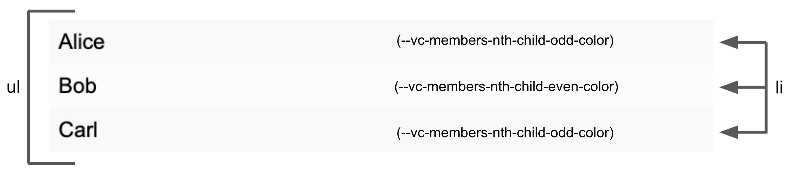

# \<vc-members>

This Web Component follows the [open-wc](https://github.com/open-wc/open-wc) recommendation and is meant to be used with the [Vonage Client SDK In-App Messaging](https://developer.vonage.com/en/vonage-client-sdk/in-app-messaging/overview).

A goal is to simplify the code needed to create a chat room quickly. Please see the Creating a chat app [tutorial](https://developer.vonage.com/en/tutorials/vg-in-app-messaging?source=vonage-client-sdk) to see an implementation using Vanilla JavaScript.

This Web Component can be used to replace a part of the Chat app UI.

## Installation

```bash
npm i @vonage/vc-members
```

## Usage

```html
<script type="module">
  import '@vonage/vc-members/vc-members.js';
</script>

<vc-members></vc-members>
```
The `vc-members` Web Component can handle all its responsibilities in a Conversation.

First, get a reference to the element:
```js
const vcMembers = document.querySelector("vc-members");
```

Then, pass the Conversation object to the Web Component:
```js
vcMembers.client = client;
vcMembers.conversationId = conversationId;
```
> **Note:** To see where `conversationId` and `client` came from, see [step 4](https://developer.vonage.com/en/tutorials/vg-in-app-messaging/create-conversation/javascript) and [step 11](https://developer.vonage.com/en/tutorials/vg-in-app-messaging/join-conversation/javascript) in the [tutorial](https://developer.vonage.com/en/tutorials/vg-in-app-messaging/introduction/javascript).

## Styling

By default, there are no styles applied to the Web Component.

The `vc-members` component uses [CSS part](https://developer.mozilla.org/en-US/docs/Web/CSS/::part) and [CSS custom properties](https://developer.mozilla.org/en-US/docs/Web/CSS/Using_CSS_custom_properties) to apply custom styles.

Here is a diagram that labels the parts of the component as well as the default style:



To style the overall component, the part is "ul". For each member in the list, the part is "li".

By setting the custom properties, "--vc-members-nth-child-odd-color" and "--vc-members-nth-child-even-color" you can customize the colors of the odd and even numbered rows.

To get the styling shown in the image:

```css
vc-members {
  height: 300px;
  --vc-members-nth-child-odd-color: #f9f9f9;
  --vc-members-nth-child-even-color: #fcfcfc;
}
vc-members::part(ul){
  width: 100%;
  height: 100%;
  padding: 0;
  overflow: auto;
  list-style: none;
}
vc-members::part(li){
  padding: 10px;
}
```

Another example could be:
```css
vc-members::part(ul) {
  list-style: disc;
  border: 2px red dotted;
}

vc-members::part(li) {
  color: black;
  font-size: 30px;
}

vc-members {
  width: 300px;
  color: white;
  --vc-members-nth-child-odd-color : green;
  --vc-members-nth-child-even-color : blue;

}
```

## Tooling configs

For most of the tools, the configuration is in the `package.json` to minimize the amount of files in your project.

If you customize the configuration a lot, you can consider moving them to individual files.

## Local Demo with `web-dev-server`

```bash
npm start
```

To run a local development server that serves the basic demo located in `demo/index.html`
