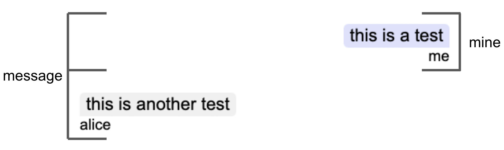
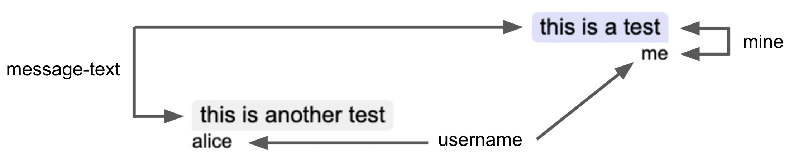

# \<vc-messages>

This Web Component follows the [open-wc](https://github.com/open-wc/open-wc) recommendation and is meant to be used with the [Vonage Client SDK In-App Messaging](https://developer.vonage.com/en/vonage-client-sdk/in-app-messaging/overview).

A goal is to simplify the code needed to create a chat room quickly. Please see the Creating a chat app [tutorial](https://developer.vonage.com/en/tutorials/vg-in-app-messaging?source=vonage-client-sdk) to see an implementation using Vanilla JavaScript.

This Web Component can be used to replace a part of the Chat app UI.

## Installation

```bash
npm i @vonage/vc-messages
```

## Usage

```html
<script type="module">
  import '@vonage/vc-messages/vc-messages.js';
</script>

<vc-messages></vc-messages>
```

### Attributes that can be used (optional):

- `loadPreviousMessages` : set to load any previous messages in the conversation. Default behavior is to load no previous messages.
- `filter` : set to filter for only the events you want to load. Default is ['message','member:joined','member:left','member:invited']

```html
<vc-messages loadPreviousMessages="10" filter='["message"]'></vc-messages>
```

The `vc-messages` Web Component can handle all its responsibilities in a Conversation.

First, get a reference to the element:
```js
const vcMessages = document.querySelector("vc-messages");
```

Then, pass the Conversation object to the Web Component:
```js
vcMessages.client = client;
vcMessages.conversationId = conversationId;
```
> **Note:** To see where `conversationId` and `client` came from, see [step 4](https://developer.vonage.com/en/tutorials/vg-in-app-messaging/create-conversation/javascript) and [step 11](https://developer.vonage.com/en/tutorials/vg-in-app-messaging/join-conversation/javascript) in the [tutorial](https://developer.vonage.com/en/tutorials/vg-in-app-messaging/introduction/javascript).

## Styling

By default, there are no styles applied to the Web Component.

The `vc-messages` component uses [CSS part](https://developer.mozilla.org/en-US/docs/Web/CSS/::part) to apply custom styles.

Here are two diagram that labels the parts of the component as well as the default style:



To style the overall message, the part is "message". To style the application user's message, the part to target is "message mine".



Each message is made up of the text (part is "message-text"), and their name (part is "username"). To specifically style the application user's message text, target "message-text mine" and for their name, the target would be "username mine".

To get the styling shown in the image:

```css
vc-messages {
  height: 300px;
}

vc-messages::part(message) {
  padding: 15px;
  margin: 5px;
}

vc-messages::part(message mine) {
  text-align: right;
}

vc-messages::part(message-text) {
  border-radius: 6px;
  background-color: #f0f0f0;
  display: inline-block;
  padding: 2px 8px;
  border-radius: 6px 6px 6px 0;
  font-size: 1.4rem;
}

vc-messages::part(message-text mine) {
  background-color: #e0e0ff;
  border-radius: 6px 6px 0px 6px;
}

vc-messages::part(username) {
  font-size: 1.2rem;
}

vc-messages::part(username mine) {
  text-align: right;
  color: black;
}
```

Another example could be:
```css
vc-messages {
  background-color: red;
  height: 300px;
}

vc-messages::part(message) {
  background-color: green;
  border-radius: 20px 20px 20px 0;
}

vc-messages::part(message mine) {
  text-align: left;
  background-color: royalblue;
  border-radius: 20px 20px 0 20px;
  border: 0;
}

vc-messages::part(message-text) {
  background-color: yellow;
  border-radius: 20px 20px 20px 0;
}

vc-messages::part(message-text mine) {
  background-color: purple;
  color: white;
  font-style: italic;
  border-radius: 20px 20px 0 20px;
}

vc-messages::part(username) {
  color: white;
}

vc-messages::part(username mine) {
  text-align: right;
  font-style: italic;
  color: black;
}
```

## Tooling configs

For most of the tools, the configuration is in the `package.json` to minimize the amount of files in your project.

If you customize the configuration a lot, you can consider moving them to individual files.

## Local Demo with `web-dev-server`

```bash
npm start
```

To run a local development server that serves the basic demo located in `demo/index.html`
