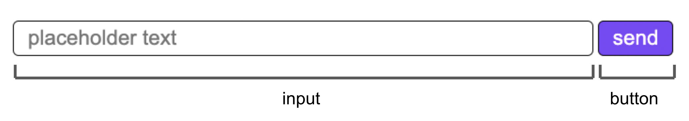

# \<vc-text-input>

This Web Component follows the [open-wc](https://github.com/open-wc/open-wc) recommendation and is meant to be used with the [Vonage Client SDK In-App Messaging](https://developer.vonage.com/en/vonage-client-sdk/in-app-messaging/overview).

A goal is to simplify the code needed to create a chat room quickly. Please see the Creating a chat app [tutorial](https://developer.vonage.com/en/tutorials/vg-in-app-messaging?source=vonage-client-sdk) to see an implementation using Vanilla JavaScript.

This Web Component can be used to replace a part of the Chat app UI.

## Installation

```bash
npm i @vonage/vc-text-input
```

## Usage

```html
<script type="module">
  import '@vonage/vc-text-input/vc-text-input.js';
</script>

<vc-text-input></vc-text-input>
```

### Attributes that can be used (optional):

- `placeholder` : set the text for the input's placeholder. Default is "Enter message".
- `buttonText` : set the text for the button. Default is "send".
- `typingTimeout` : set the number of milliseconds before sending the stop typing indication. Default is 500.

```html
<vc-text-input placeholder="your placeholder text"  buttonText="enter" typingTimeout="1500" ></vc-text-input>
```

The `vc-text-input` Web Component can handle all its responsibilities in a Conversation.

First, get a reference to the element:
```js
const vcTextInput = document.querySelector("vc-text-input");
```

Then, pass the Conversation object to the Web Component:
```js
vcTextInput.client = client;
vcTextInput.conversationId = conversationId;
```
> **Note:** To see where `conversationId` and `client` came from, see [step 4](https://developer.vonage.com/en/tutorials/vg-in-app-messaging/create-conversation/javascript) and [step 11](https://developer.vonage.com/en/tutorials/vg-in-app-messaging/join-conversation/javascript) in the [tutorial](https://developer.vonage.com/en/tutorials/vg-in-app-messaging/introduction/javascript).

## Styling

By default, there are no styles applied to the Web Component.

The `vc-text-input` component uses [CSS part](https://developer.mozilla.org/en-US/docs/Web/CSS/::part) to apply custom styles.

Here is a diagram that labels the parts of the component as well as the default style:



To style the input element, the part is "input". For the button element, the part is "button".

To get the styling shown in the image:

```css
vc-text-input {
  display: flex;
  justify-content: space-between;
}

vc-text-input::part(button) {
  color: white;
  padding: 5px 15px;
  background-color: transparent;
  border: 1px solid black;
  border-radius: 6px;
  cursor: pointer;
  background: #871fff;
  font-size: 1.4rem;
}

vc-text-input::part(input) {
  color: black;
  padding: 5px 15px;
  background-color: transparent;
  border: 1px solid black;
  border-radius: 6px;
  width: 100%;
  font-size: 1.4rem;
}
```

Another example could be:
```css
vc-text-input::part(button) {
  color: red;
  border: 2px green solid;
  font-size: 30px;
  background-color: transparent;
}

vc-text-input::part(input) {
  color: red;
  border-radius: 0px;
  border: 4px blue dotted;
  background-color: yellow;
}
```

## Tooling configs

For most of the tools, the configuration is in the `package.json` to minimize the amount of files in your project.

If you customize the configuration a lot, you can consider moving them to individual files.

## Local Demo with `web-dev-server`

```bash
npm start
```

To run a local development server that serves the basic demo located in `demo/index.html`
