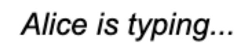

# \<vc-typing-indicator>

This Web Component follows the [open-wc](https://github.com/open-wc/open-wc) recommendation and is meant to be used with the [Vonage Client SDK In-App Messaging](https://developer.vonage.com/en/vonage-client-sdk/in-app-messaging/overview).

A goal is to simplify the code needed to create a chat room quickly. Please see the Creating a chat app [tutorial](https://developer.vonage.com/en/tutorials/vg-in-app-messaging?source=vonage-client-sdk) to see an implementation using Vanilla JavaScript.

This Web Component can be used to replace a part of the Chat app UI.

## Installation
```bash
npm i @vonage/vc-typing-indicator
```

## Usage
```html
<script type="module">
  import '@vonage/vc-typing-indicator/vc-typing-indicator.js';
</script>

<vc-typing-indicator></vc-typing-indicator>
```
The `vc-typing-indicator` Web Component can handle all its responsibilities in a Conversation.

First, get a reference to the element:
```js
const vcTypingIndicator = document.querySelector("vc-typing-indicator");
```

Then, pass the Client object and Conversation ID to the Web Component:
```js
vcTypingIndicator.client = client;
vcTypingIndicator.conversationId = conversationId;
```
> **Note:** To see where `conversationId` and `client` came from, see [step 4](https://developer.vonage.com/en/tutorials/vg-in-app-messaging/create-conversation/javascript) and [step 11](https://developer.vonage.com/en/tutorials/vg-in-app-messaging/join-conversation/javascript) in the [tutorial](https://developer.vonage.com/en/tutorials/vg-in-app-messaging/introduction/javascript).

## Styling

By default, there are no styles applied to the Web Component.

Styling the component is the same as you would style another element tag like `h1`.



To get the styling shown in the image:

```css
vc-typing-indicator {
  font-style: italic;
}
```

Another example could be:
```css
vc-typing-indicator {
  color: red;
  border: 2px green solid;
  font-size: 30px;
  font-style: normal;
}
```

## Tooling configs

For most of the tools, the configuration is in the `package.json` to minimize the amount of files in your project.

If you customize the configuration a lot, you can consider moving them to individual files.

## Local Demo with `web-dev-server`

```bash
npm start
```

To run a local development server that serves the basic demo located in `demo/index.html`
